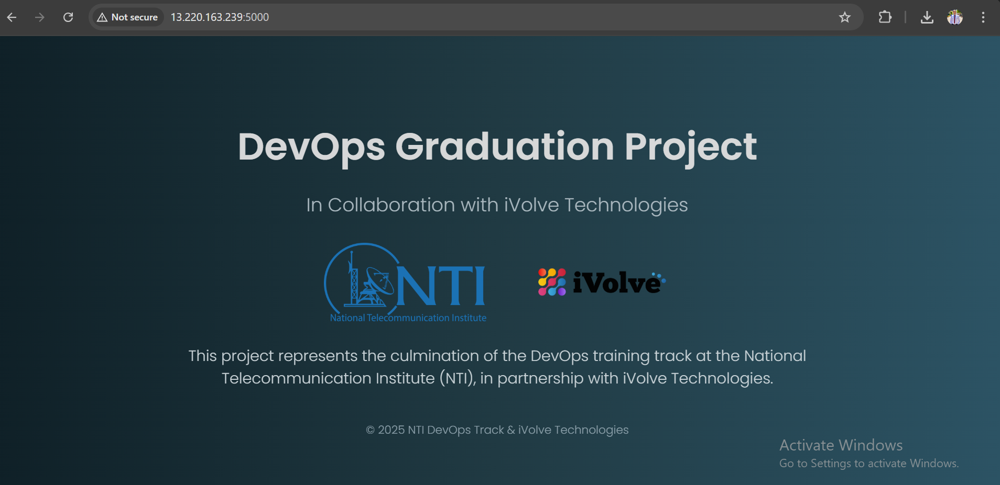
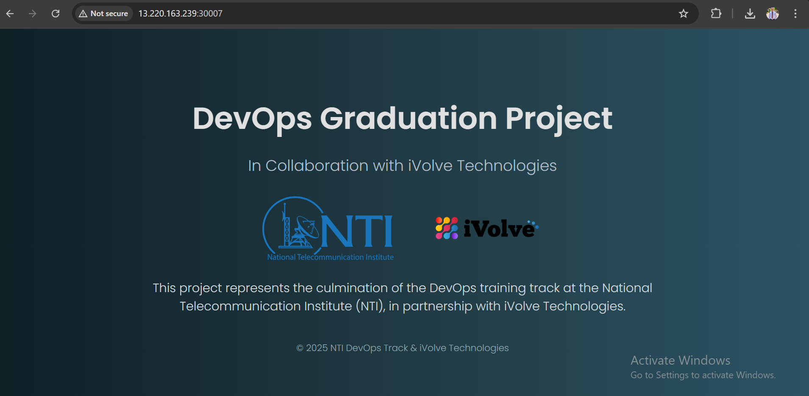
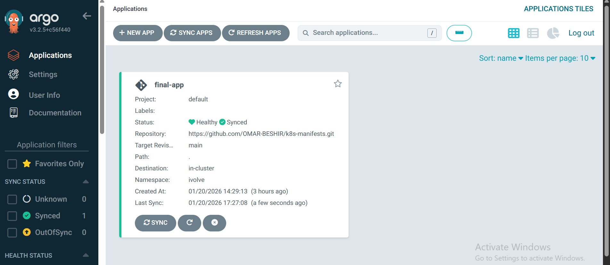

<p align="center">
  
  &nbsp;&nbsp;&nbsp;&nbsp;
  
</p>

<h1 align="center" style="font-family: 'Poppins', sans-serif; color: #e0e0e0; font-size: 2.8rem;">
   DevOps Graduation Project
</h1>

<h3 align="center" style="font-family: 'Poppins', sans-serif; color: #b0bec5;">
  In Collaboration with iVolve Technologies
</h3>

<p align="center" style="max-width: 700px; font-size: 1.1rem; color: #cfd8dc;">
  This project represents the culmination of the DevOps training at the National Telecommunication Institute (NTI),
  in partnership with iVolve Technologies. 
</p>

---

# CloudDevOps Project - Complete CI/CD Pipeline

## 📋 Project Overview

This project demonstrates a complete DevOps CI/CD pipeline implementing infrastructure as code, containerization, orchestration, continuous integration, and continuous deployment using industry-standard tools and best practices.

The pipeline automates the entire software delivery process from code commit to production deployment, incorporating security scanning, GitOps principles, and self-healing capabilities.

---

## 🏗️ Architecture Overview

**End-to-End Flow:**
Developer Push → GitHub → Jenkins CI → DockerHub → Git Manifests → ArgoCD → Kubernetes

### High-Level Architecture Diagram


---

## 🛠️ Technologies & Tools

| Category          | Tool         | Purpose                                |
| ----------------- | ------------ | -------------------------------------- |
| Containerization  | Docker       | Application containerization           |
| Orchestration     | Kubernetes   | Container orchestration and management |
| Infrastructure    | Terraform    | Infrastructure as Code (IaC)           |
| CI Pipeline       | Jenkins      | Continuous Integration automation      |
| CD Pipeline       | ArgoCD       | GitOps-based Continuous Deployment     |
| Cloud Provider    | AWS          | Cloud infrastructure hosting           |
| Security Scanning | Trivy        | Container vulnerability scanning       |
| Version Control   | Git / GitHub | Source code and manifest management    |

---

## 📁 Project Structure

```
CloudDevOpsProject/
├── docker/
│   ├── Dockerfile
│   ├── app.py
│   └── requirements.txt
├── kubernetes/
│   ├── namespace.yaml
│   ├── deployment.yaml
│   └── service.yaml
├── terraform/
│   ├── main.tf
│   ├── provider.tf
│   ├── variables.tf
│   ├── outputs.tf
│   ├── backend.tf
│   └── modules/
│       ├── network/
│       └── server/
├── jenkins/
│   ├── Jenkinsfile
│   └── vars/
│       ├── dockerBuild.groovy
│       ├── trivyScan.groovy
│       ├── dockerPush.groovy
│       ├── deleteLocalImage.groovy
│       └── updateK8sManifests.groovy
├── argocd/
│   └── application.yaml
└── docs/
    ├── DOCKER.md
    ├── KUBERNETES.md
    ├── TERRAFORM.md
    ├── JENKINS.md
    └── ARGOCD.md
```

---

## 🚀 Features

### ✅ Infrastructure as Code

* Automated AWS infrastructure provisioning using Terraform
* Modular architecture (Network & Server modules)
* Remote state management with S3 backend
* CloudWatch monitoring integration

### ✅ Containerization

* Optimized Docker images
* Python Flask application containerization
* DockerHub registry integration

### ✅ Kubernetes Orchestration

* Multi-replica deployment for high availability
* Service exposure using NodePort
* Namespace isolation
* Auto-healing and self-recovery

### ✅ CI/CD Pipeline

* Fully automated build and deployment workflow
* Security vulnerability scanning using Trivy
* Jenkins Shared Library for reusable pipeline logic
* GitOps-based deployment model

### ✅ Continuous Deployment

* ArgoCD automated synchronization
* Self-healing capabilities
* Automatic pruning of obsolete resources
* Real-time cluster state monitoring

---

## 📊 Pipeline Workflow

### CI/CD Flow Diagram


1. **Developer Workflow**
   Developer → Push Code → GitHub Repository

2. **Jenkins CI Pipeline**
   Build Image → Scan Image → Push to DockerHub → Update Kubernetes Manifests

3. **ArgoCD Deployment**
   Detect Changes → Sync to Cluster → Deploy Application

4. **Kubernetes Cluster**
   Rolling Updates → Health Checks → Self-Healing

---

## 🎯 Implementation Steps

### Prerequisites

* AWS Account with required permissions
* GitHub Account
* DockerHub Account
* Basic DevOps knowledge

### 1. Infrastructure Setup

```bash
cd terraform/
terraform init
terraform plan
terraform apply
```

### 2. Containerize Application

```bash
cd docker/
docker build -t your-app:v1 .
docker push your-dockerhub/your-app:v1
```

### 3. Deploy to Kubernetes

```bash
cd kubernetes/
kubectl apply -f namespace.yaml
kubectl apply -f deployment.yaml
kubectl apply -f service.yaml
```

### 4. Configure Jenkins Pipeline

* Jenkins installed on EC2 using Terraform `user_data`
* Configure DockerHub & GitHub credentials
* Create pipeline job using `Jenkinsfile`

### 5. Setup ArgoCD

```bash
kubectl create namespace argocd
kubectl apply -n argocd -f https://raw.githubusercontent.com/argoproj/argo-cd/stable/manifests/install.yaml
kubectl apply -f argocd/application.yaml
```

---

## 📸 Screenshots

### Infrastructure Provisioning


### Docker Image Build



### Kubernetes Cluster



### Jenkins Pipeline


### ArgoCD Dashboard



### Application Running


---

## 🔒 Security Implementation

* Trivy vulnerability scanning for Docker images
* AWS Security Groups and Network ACLs
* Jenkins credentials binding
* Kubernetes RBAC
* GitOps audit trail for all deployments

---

## 📈 Monitoring & Observability

* CloudWatch EC2 monitoring
* CloudWatch alarms with SNS notifications
* ArgoCD UI real-time health status
* Kubernetes events monitoring

---

## 🎓 Key Learnings

* Infrastructure as Code best practices
* CI/CD automation using Jenkins & ArgoCD
* GitOps methodology
* Cloud-native deployment strategies
* Security scanning integration

---

## 🔄 Future Enhancements

* [ ] Helm charts integration
* [ ] Prometheus & Grafana monitoring
* [ ] EKS cluster using Terraform
* [ ] SonarQube integration
* [ ] Multi-environment deployment
* [ ] Ansible configuration management
* [ ] Service Mesh integration

---

## 📚 Documentation

* Docker Setup
* Kubernetes Configuration
* Terraform Infrastructure
* Jenkins CI Pipeline
* ArgoCD Deployment

---

## 👨‍💻 Author

**Omar Beshir**

* GitHub: @OMAR-BESHIR
* Email: [obeshir306@gmail.com](mailto:obeshir306@gmail.com)

---

## 🙏 Acknowledgments

* iVolve Training Program
* DevOps Community
* Open Source Contributors

---

If you found this project helpful, please give it a star!

Built with using modern DevOps practices
